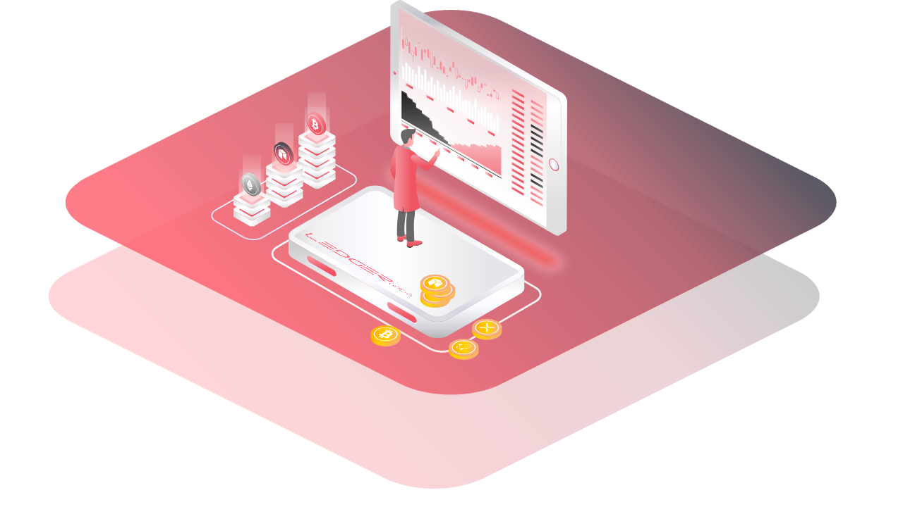

# Learning Center

Im Learning Center findest Du alle Informationen zu Blockchain und Distributed Ledger Technologies \(DLT\) sowie zu den zugrundeliegenden Basis-Technologien. Hier findest Du unabhängige und verständliche Informationen rund um Blockchain, Smart Contracts, Kryptografie, Konsens-Mechanismen oder Digitalen Vermögenswerten. 

## Inhalte

1. Grundlagen
   * [Peer-to-Peer Netzwerke](https://lab.ledgerlabs.li/grundlagen/peer-to-peer)
   * [Kryptografie](https://lab.ledgerlabs.li/grundlagen/kryptografie)
   * [Konsens-Mechanismen](https://lab.ledgerlabs.li/grundlagen/konsens-mechanismen)
2. Blockchain
   * [Hintergrund](https://lab.ledgerlabs.li/dlt/blockchain/hintergrund)
   * [Definition](https://lab.ledgerlabs.li/dlt/blockchain/definition)
   * [Anwendungsgebiete](https://lab.ledgerlabs.li/dlt/blockchain/anwendungsgebiete)
3. Distributed Ledger Technologien
   * [Hintergrund](https://lab.ledgerlabs.li/dlt/distributed-ledger-technologien/hintergrund)
   * [Definition](https://lab.ledgerlabs.li/dlt/distributed-ledger-technologien/definition)
   * [Projekte](https://lab.ledgerlabs.li/dlt/distributed-ledger-technologien/projekte)
4. Technologie-Stack
   * [Infrastruktur](https://lab.ledgerlabs.li/technologie/infrastruktur)
   * [Protokoll](https://lab.ledgerlabs.li/technologie/protokoll)
   * [Services](https://lab.ledgerlabs.li/technologie/services)
   * [Applikationen](https://lab.ledgerlabs.li/technologie/applikationen)
   * [Governance](https://lab.ledgerlabs.li/technologie/governance)
5. Decentralized Finance \(DeFi\)
   * [Hintergrund](https://lab.ledgerlabs.li/defi/defi/hintergrund)
   * [Definition](https://lab.ledgerlabs.li/defi/defi/definition)
   * [Anwendungsgebiete](https://lab.ledgerlabs.li/defi/defi/anwendungsgebiete)
6. Kryptowährungen
   * [Hintergrund](https://lab.ledgerlabs.li/defi/kryptowaehrungen/hintergrund)
   * [Definition](https://lab.ledgerlabs.li/defi/kryptowaehrungen/definition)
   * [Projekte](https://lab.ledgerlabs.li/defi/kryptowaehrungen/projekte)
7. Digital Assets
   * [Hintergrund](https://lab.ledgerlabs.li/defi/digital-assets/hintergrund)
   * [Definition](https://lab.ledgerlabs.li/defi/digital-assets/definition)
   * [Projekte](https://lab.ledgerlabs.li/defi/digital-assets/projekte)

## Mitwirken

### Kommunikation

* Bleibe beim Thema: Bitte poste und diskutiere Themen, die für die Blockchain und Distributed Ledger Technologien relevant sind. 
* Give More Than You Take: Was eine Gemeinschaft erstaunlich macht, ist, wenn die Mitglieder mehr darauf ausgerichtet sind, einander zu helfen, als sich selbst zu helfen. Sei so hilfreich wie möglich und jeder profitiert davon! 
* Keine Hassreden oder Mobbing: Hinterfrage Ideen respektvoll und greife niemanden persönlich an. Hilf uns, dass sich jeder in der Gemeinschaft sicher fühlt. Mobbing jeglicher Art ist nicht erlaubt, und erniedrigende Kommentare über Dinge wie Rasse, Religion, Kultur, sexuelle Orientierung, Geschlecht oder Identität werden nicht toleriert. 

### Dieses Wiki bearbeiten 

* Fühlen Dich frei, zu jedem Teil dieses Wikis beizutragen - Beiträge sind sehr willkommen! 
* Bitte Achte darauf, alle Quellen Deiner Informationen nach [APA Richtlinien](https://www.scribbr.de/apa-standard/verweise-im-text-laut-apa-standard/) anzugeben und im Quellenverzeichnis beizufügen [\(zum APA Generator\)](https://www.scribbr.de/zitieren/apa-generator/?scr_source=knowledgebase&scr_medium=in-text&scr_campaign=apa-generator-kostenlos&frm=#/).
* Repo: [https://github.com/distributed-governance/wiki ](https://github.com/ledgerlabs-li/wiki)- offen für Beiträge \([Pull Request Tutorial](https://help.github.com/en/github/collaborating-with-issues-and-pull-requests/about-pull-requests)\)
* Die Diskussion kann im GitHub Repo stattfinden

