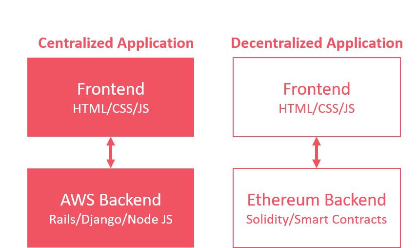

# DApps

## In Kürze

Dezentralisierte Applikationen \(DApps\) sind Anwendungen, die in einem P2P-Netzwerk von Computern statt auf einem einzelnen Computer laufen. Sie werden als eine Form von Software-Programmen betrachtet, die dazu bestimmt sind, im Internet zu funktionieren, ohne von einer zentralen Instanz kontrolliert zu werden. Wie eine traditionelle Applikation können DApps Front-End-Code und Benutzeroberflächen in jeder beliebigen Programmiersprache enthalten. Darüber werden dann Anfragen an das Blockchain-basierte Backend gestellt. \(Blockgeeks, 2018\)

## Eigenschaften von DApps

* **Open Source Software:** Idealerweise handelt es sich bei DApps um Open Source Software - das heisst, der Quellcode ist öffentlich zugänglich und jeder kann ihn überprüfen, dazu beitragen oder kopieren.
* **Dezentralisiert:** Wie der Name schon sagt streben DApps eine möglichst hohe Dezentralisierung an. Entsprechend werden sie durch verteilte Nutzer und Netwerkknoten aufrecht erhalten.
* **Sicher:** Bei dezentralen Applikationen gibt es keinen Single-Point-of-Failure. Transaktionen werden unveränderbar auf einer \(öffentlichen\) Blockchain gespeichert und kryptografisch gesichert.
* **Anreize:** Viele DApps nutzen Tokens zur Gestaltung von Anreizen für die Nutzer der Applikation. Dabei kann es sich um native Kryptowährungseinheiten einer Blockchain handeln oder aber um spezifische Tokens für die jeweilige DApp.

Es gibt eine grosse Vielfalt an DApps für unterschiedliche Anwendungsfällen. Sie können Spiele, Social-Media-Plattformen, Kryptowährungsbörsen oder auch Finanzanwendungen \(DeFi\) umfassen.


**Tipp:** Auf der Webseite [https://www.stateofthedapps.com/de/dapps](https://www.stateofthedapps.com/de/dapps) findest Du eine Übersicht über existierende DApps für unterschiedliche Blockchain-/ Smart Contract-Plattformen.


