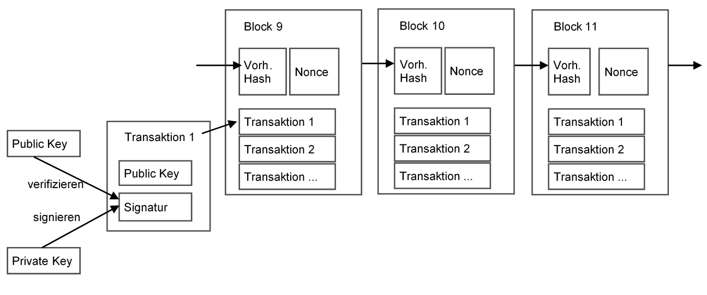

# Definition

Lewrick und Di Giorgio \(2018\) definieren eine Blockchain als dezentrale Datenstruktur, die mit Hilfe kryptographischer Signaturen die Unveränderlichkeit und Rückverfolgbarkeit der Daten gewährleistet.

Aus technischer Sicht ist eine Blockchain ist eine unveränderliche Liste von Transaktionen in einem verteilten Netzwerk. Die Nutzer können Listeneinträge vornehmen. Diese werden von vielen Netzwerkknoten gespeichert und von mehreren Parteien \(Minern\) validiert. Jeder Listeneintrag \(Transaktion\) eines Teilnehmers enthält eine individuelle digitale Signatur. Die Einträge werden von allen Netzwerkknoten gespeichert, zu Transaktionsblöcken zusammengefasst und sequentiell miteinander verknüpft \(Kette\). Zur Validierung von Transaktionen wird ein Konsensmechanismus verwendet. Im klassischen Fall \(Proof-of-Work\) wird aus jedem Transaktionsblock ein digitaler Fingerabdruck \(Hash\) berechnet, der wiederum in den nächsten Block integriert wird und so die Blöcke in einer bestimmten Reihenfolge verknüpft. Das Ergebnis steht allen Netzwerkknoten zur Verfügung, so dass vergangene Transaktionen nicht mehr geändert werden können. \(Antonopoulos, 2018\).

## **In Kürze**

> Die Blockchain ist eine dezentrale Datenstruktur, die durch kryptografische Signaturen und "Hash"-Codes Eigenschaften der Unveränderbarkeit und Nachvollziehbarkeit garantiert.

Die Abbildung zeigt, wie Blöcke über die digitale Signatur \(Hash\) des vorherigen Blocks miteinander verknüpft werden. Das Ergebnis der Validierung ist ein Platzhalter \(Nonce\), der ungültig wird, sobald jemand versucht, die Transaktionsdaten innerhalb eines vorhergehenden Blocks zu manipulieren. 

Was 2008 mit einem ersten Whitepaper von Satoshi Nakamoto begann, wird nun auf andere Bereiche übertragen. Mit der Einführung von Ethereum im Jahr 2015 wurde die erste Blockchain entwickelt, auf der regelbasierte Verträge zu digitalen Vermögenswerten \(Smart Contracts\) abgeschlossen werden können.

Dadurch ergeben sich zahlreiche Möglichkeiten weit über Kryptowährungen hinaus. So können öffentliche Blockchains teilweise Aufgaben von Intermediären wie Banken oder Versicherungen durch Dezentralisierung und regelbasierte Verträge ersetzen und bieten Eigenschaften wie Unveränderlichkeit, Datenschutz, Vertrauen, Kompatibilität, Transparenz, Redundanz und Offenheit \(Hosp, 2018, S.70\).

