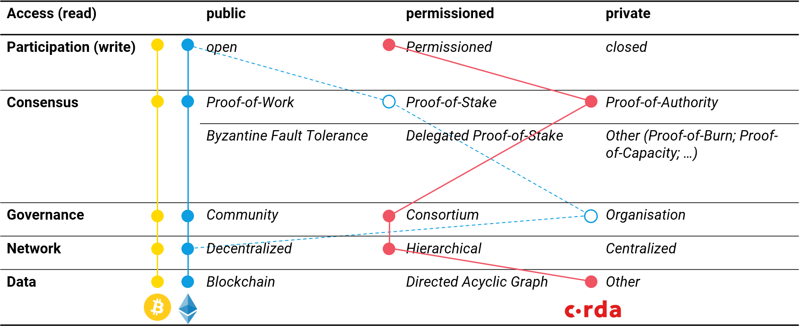

# Definition

Technisch gesehen wird eine Blockchain durch das Erstellen eines Protokolls erzeugt, welches die Regeln der Datenstruktur festlegt und den Teilnehmern zur Verfügung stellt. Diese setzen die Blockchain gemäss Protokoll um und halten sie auf dem neuesten Stand. \(Hosp, 2018, S. 62\).   
****  
Blockchain-Protokolle können sich in verschiedenen Aspekten unterscheiden. So können Daten auf einer Blockchain beispielsweise entweder öffentlich sichtbar \(public\) oder nur für ausgewählte Teilnehmer sichtbar \(private\) sein. Andererseits kann der Zugang respektive die Teilnahme im Netzwerk offen \(open/ permission-less\) oder beschränkt \(permissioned\) sein. Die meisten öffentlichen Blockchains sind ebenfalls offen, was bedeutet, dass jeder am Netzwerk teilnehmen kann. Zugangsbeschränkte Blockchains hingegen kontrollieren und zertifizieren die Teilnahme an Transaktionen innerhalb des Netzwerks. Die Art des Zugangs wirkt sich ebenfalls auf den Netzwerktyp aus. So kann beobachtet werden, dass offene Blockchains wie Bitcoin oder Ethereum eine grössere Anzahl an Netzwerkknoten \(nodes\) aufweisen als zugangsbeschränkte wie z.B. Corda oder Hyperledger.

Somit sind vier Kombinationen verschiedener Blockchain-Typen möglich: öffentlich & offen; öffentlich & zugangsbeschränkt; privat & offen sowie privat & zugangsbeschränkt. \(Hosp, 2018, S. 64 - 65\). Je nach Typ eignet sich eine andere Art der Konsens-Findung. Öffentliche Blockchains verwenden den Rechenleistungs-intensiven Proof-of-Work Algorithmus \(mining\), um zwischen allen Teilnehmern korrekte Transaktionen zu bestätigen. Aufgrund der vorherigen Zugangsprüfung arbeiten permissioned Blockchains demnach oftmals mit einfacheren Algorithmen wie Byzantine Fault Tolerance oder Proof-of-Authority. Ein weiterer wesentlicher Unterschied zwischen den verschiedenen Blockchains ist das Interaktionslevel. Während Bitcoin ursprünglich nur als digitale Liste von Transaktionen angedacht war, wurde mit Ethereum im Jahr 2015 erstmals eine Plattform für den Wertaustausch mittels programmierbaren Smart Contracts geschaffen. Von den vier genannten Blockchain-Arten, kommen öffentliche und offene \(public & open\) sowie private und zugangsbeschränkte \(private & permissioned\) Blockchains am häufigsten vor.

