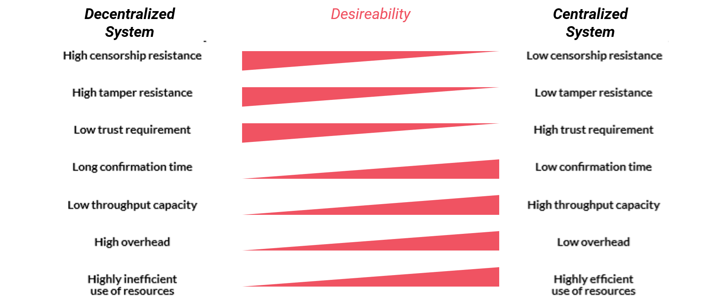

# Dezentralisierung

Im Zusammenhang mit [Peer-to-Peer Netzwerken](https://lab.ledgerlabs.li/grundlagen/peer-to-peer) wird oft von Dezentralisierung gesprochen. Da der Begriff der Dezentralisierung oft inflationär und falsch angewendet wird, ist darauf zu achten, in welchem Zusammenhang von Dezentralisierung gesprochen wird. Consensys \(2019\) definiert Dezentralisierung als die Übertragung von Autorität und Verantwortlichkeit von einer zentralen Organisation, Regierung oder Partei zu einem verteilten Netzwerk. Diese Definition der Dezentralisierung deckt gemäss Buterin \(2018\) jedoch nur einen Teil der möglichen Ausprägungen von dezentralen Systemen ab - die politische Dezentralisierung. Buterin \(2018\) unterscheidet entsprechend zwischen drei Arten der Dezentralisierung:

1. Politische Dezentralisierung
2. Architektonische Dezentralisierung
3. Logische Dezentralisierung

Gemäss Buterin \(2018\) sind Blockchain-Systeme politisch dezentralisiert. Das heisst, sie werden von niemandem kontrolliert. Durch global verteilte Netzwerkknoten sind diese ebenfalls dezentral aufgebaut \(architektonische Dezentralisierung\), wodurch es keinen "Single-Point-of-Failure" gibt. In Bezug auf die Logik sind Blockchain-Systeme hingegen stark zentralisiert. Im Blockchain Protokoll manifestieren sich die Regeln nach welchen im P2P-System gehandelt wird bzw. wie das System aufgebaut ist. Wie in der Vergangenheit gezeigt wurde, ergibt sich dadurch beispielsweise bei Bitcoin oder Ethereum die Herausforderung wie in einem dezentralen System Änderungen vorgenommen werden. Aus diesem Grund beschäftigen sich aktuell viele Forscher mit der Governance von Blockchain-Systemen.

In einem Vergleich von zentralen zu dezentralen Systemen zeigen Rauchs et al. \(2018\) unterschiedliche Vor- und Nachteile auf. Während politisch und architektonisch dezentralisierte Systeme schwer zensierbar sind und durch Ihre Unveränderbarkeit eine hohe Datensicherheit bei minimalem Vertrauen zu den anderen Netzwerkteilnehmern ermöglichen, büssen Sie im Gegenzug dafür an Effizienz durch fehlende Skaleneffekte ein. 

Entsprechend befassen sich zahlreiche [Distributed Ledger Technologien](https://lab.ledgerlabs.li/dlt/distributed-ledger-technologien) aktuell mit dem Trade-off zwischen Sicherheit und Skalierbarkeit, welcher sich aus der dezentralen Natur verteilter Systeme ergibt. 

  

