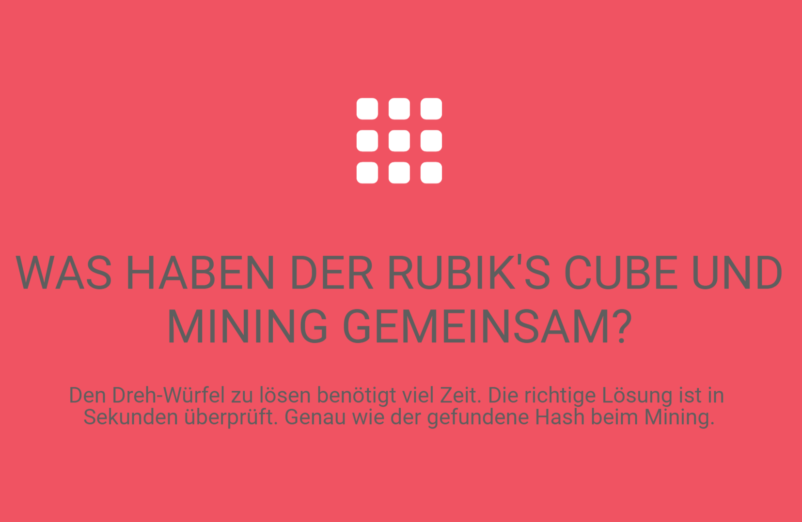

# Konsens-Mechanismen

Damit sich in einem dezentral organisierten System alle Teilnehmer korrekt verhalten, müssen entsprechend wirtschaftliche Anreize für die einzelnen Teilnehmer konzipiert werden. In einem Blockchain System soll dies garantieren, dass das Netzwerk fehlertolerant, unangreifbar und sicher vor Absprachen unter einer Gruppe von Teilnehmern ist. Oftmals werden solche Anreize durch kryptographischen Token generiert, welche die Belohnung für die korrekte Validierung von Transaktionen auf der Blockchain darstellen. Um sicherzustellen, dass sich die Netzwerkteilnehmer ehrlich verhalten, werden Transaktionen  gemeinsam validiert und gegenseitig überprüft. Hierfür gibt es unterschiedliche Konsens-Mechanismen. \(Voshmgir & Kalinov, 2018\)

Konsens-Mechanismen sind Protokolle, die sicherstellen, dass alle Netzwerkknoten miteinander synchronisiert werden und sich darauf einigen, welche Transaktionen legitim sind und folglich der Blockchain angefügt werden sollen. Die am weitesten verbreiteten Konsens-Mechanismen sind Proof-of-Work \(PoW\) und Proof-of-Stake. In PoW lösen Miner komplexe mathematische Rätsel, die viel Rechenleistung erfordern. Der erste, der das Rätsel löst, darf einen Block erstellen und erhält eine Belohnung für die Erstellung eines Blocks. In PoS haben diejenigen, die die meisten Vermögen \(Coins\) in einem Netzwerk besitzen ein Interesse daran, das Netzwerk aufrechtzuerhalten. Validierer von Transaktionen werden unter Einbezug ihres Vermögens zufällig ausgewählt für die korrekte Erstellung von Transaktionsblöcken entlohnt. \(Hackernoon, 2018\) 

