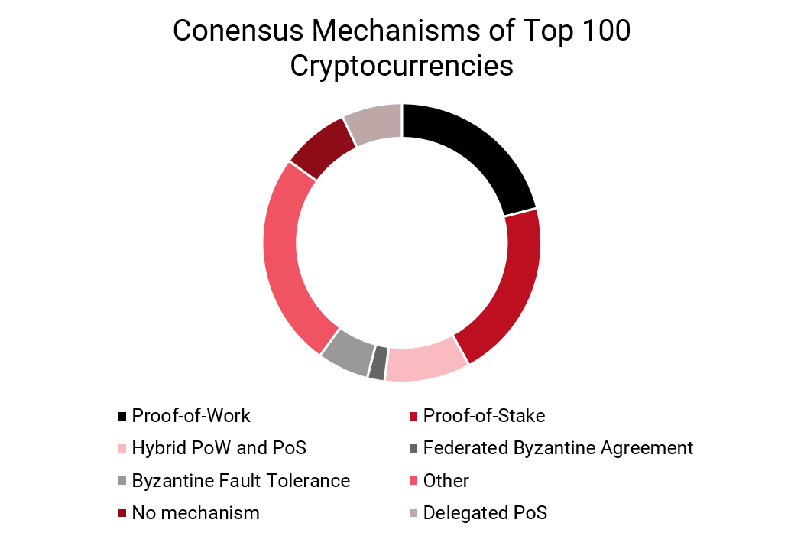

# Andere Konsens-Mechanismen

Neben PoW und PoS gibt es in der Praxis noch zahlreiche weitere Konsens-Mechanismen respektive Abwandlungen dieser. 

* Proof-of-Work \(Bitcoin, Ethereum, Ethereum Classic, Litecoin, …\)
* Proof-of-Stake \(Ethereum 2.0, Dash, Enigma, …\)
* Delegated Proof-of-Stake \(EOS, Lisk, Nano, …\)
* Proof-of-Capacity \(Siacoin, Storj\)
* Byzantine fault tolerance \(Hyperledger\)
* Proof of authority \(VeChain, Corda\)

Gemäss einer Untersuchung von Hays und Valek \(2018\) sind unter den Top 100 Kryptowährungen PoW und PoS bzw. eine hybride Lösung aus beiden Mechanismen am weitesten verbreitet. Nachfolgend werden die gängigsten Alternativen kurz erläutert.

### **Delegated Proof-of-Stake \(DPoS\)**

In DPoS stimmen die Inhaber von Token nicht selbst über die Gültigkeit der Blöcke ab, sondern wählen Vertreter, die die Validierung in ihrem Namen durchführen. In der Regel gibt es in einem DPoS-System zwischen 21-100 gewählte Vertreter. Die Delegierten werden regelmässig gemischt und erhalten den Auftrag, ihre Blöcke einzureichen. \(Whiterspoon, 2018\)

### **Proof-of-Authority \(PoA\)**

Proof-of-Authority ist ein Konsensverfahren, bei dem Transaktionen durch genehmigte Benutzer validiert werden, ähnlich wie Systemadministratoren. Diese Konten stellen die Instanz dar, von der andere Knoten ihre Wahrheit erhalten. PoA hat einen hohen Durchsatz von Transaktionen und ist für private Netzwerke optimiert. PoA wird meist nicht in einer öffentlichen Blockchain verwendet, da es sich um eine zentralisierte Lösung handelt. \(Whiterspoon, 2018\)

###  **Byzantine Fault Tolerance \(BFT\)**

Die byzantinische Fehlertoleranz \(BFT\) ist die Eigenschaft eines Systems, das in der Lage auch dann zu funktionieren, wenn einige der Knoten ausfallen oder böswillig handeln. In anderen Worten muss die Mehrheit der Teilnehmer innerhalb eines verteilten Netzwerks sich einigen um einen Totalausfall zu vermeiden. Dafür werden mindestens ⅔ ehrliche Netzwerkknoten benötigt. Wenn die Mehrheit des Netzwerks beschliesst, böswillig zu handeln, ist das System angreifbar. \(Binance, 2019\)

### Proof-of-Capacity \(PoC\)

Bei Proof-of-Capacity werden ähnlich wie bei PoW Lösungen zu einer Aufgabe zur Verkettung von Transaktionsblöcken gesucht. Die Lösungen werden dabei nicht berechnet sonder in digitalen Datenspeichern \(z.B. Festplatten\) vorab gespeichert. Nachdem ein Speicher geplottet wurde \(d.h. er wurde mit Lösungen gefüllt\), kann er am Prozess der Blockerstellung teilnehmen. Die Blockvalidierung erfolgt durch die Suche nach vorgefertigten Lösungen. Validatoren mit höherer Speicherkapazität finden eher einen Block, da sie mehr Lösungen durchsuchen können. \(Binance, 2019\)

