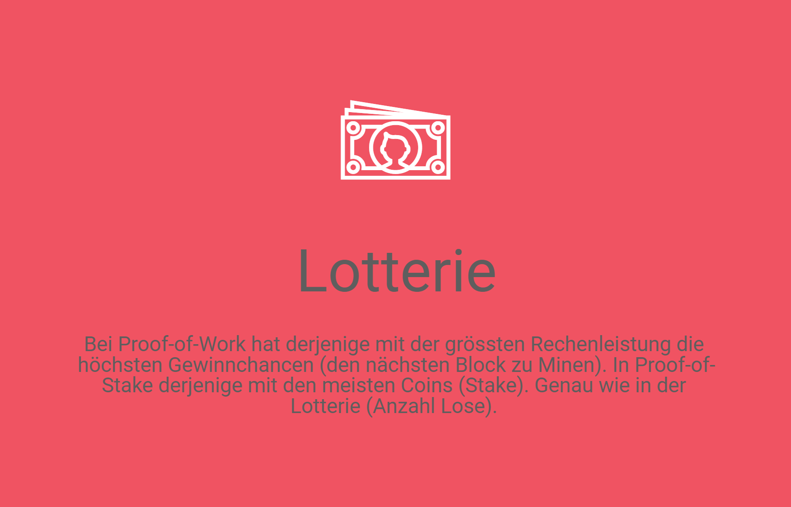

# Proof-of-Stake

In PoS werden die Blöcke nicht durch Rechenleistung validiert, sondern von Validatoren, die ihr Vermögen in Form von Tokens \(Stake\) darauf verwetten, welche Transaktionen korrekt sind. Im Fall von Uneinigkeiten verwenden die Validatoren ihre Token, um darüber abzustimmen, welche Version sie unterstützen wollen. Angenommen, die meisten Leute stimmen für die richtige Version, so würden diejenigen, die für die falsche Version abgestimmt haben, ihren eingesetzten Anteil verlieren. Somit werden auch bei PoS Anreize geschaffen, dass nur korrekte Transaktionen validiert werden. \(Whiterspoon, 2018\)

## In Kürze...

* Blockersteller werden als Validierer bezeichnet. Validierer müssen eine Einzahlung \(Stake\) leisten, um an der Blockerstellung teilzunehmen.
* Während bei Proof-of-Work \(PoW\) die Validierer im Wettbewerb zu einander stehen, basiert die Auswahl der Validatoren bei PoS auf einer pseudo-zufälligen Funktion unter Berücksichtigung des getätigten Einsatzes.
* Im Gegensatz zu reduziert PoS den Energieverbrauch, da nur ein Prüfer auf einmal die Transaktionen validiert und dafür keine Rechenleistung benötigt wird sondern Anreize sich korrekt zu verhalten über den Einsatz von Vermögen generiert werden.
* Wenn sich Validatoren falsch verhalten bzw. falsche Transaktionen validieren, verlieren sie ihren Einsatz. Da der Einsatz höher ist als die Belohnung für die korrekte Validierung, haben die Prüfer einen Anreiz sich korrekt zu verhalten. 

