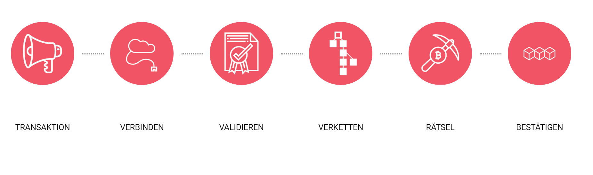
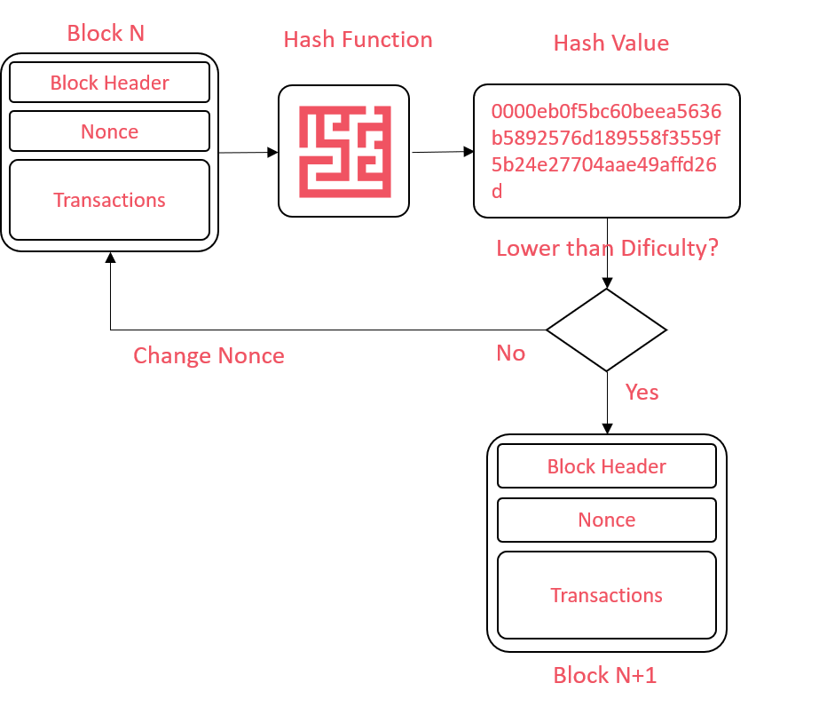

# Proof-of-Work

Proof-of-Work \(PoW\) war der erste Konsens-Algorithmus einer Blockchain. Satoshi Nakamoto \(2008\) hat den PoW-Algorithmus von Back \(2002\) für den Einsatz in der Bitcoin-Blockchain übernommen. Dem PoW-Algorithmus verdanken wir nicht nur die hohe Sicherheit der Bitcoin Transaktionen, sondern auch die Mining-Aktivitäten und den damit einhergehenden Stromverbrauch. PoW ist bei einer grossen Anzahl Netzwerkknoten ein sehr zuverlässiges aber ineffizientes System zur Validierung von Transaktionen. Aufgrund dieser Ineffizienzen arbeiten zu diesem Zeitpunkt zahlreiche Organisationen an effizienteren Mechanismen, mit dem Ziel möglichst wenig der Sicherheit des PoW aufgeben zu müssen. Ein Beispiel dafür stellt das Ethereum-Projekt dar welches einen Wechsel vom PoW-Algorithmus zum Energieeffizienten und wirtschaftlichen Proof-of-Stake \(PoS\)-Algorithmus plant \(Whiterspoon, 2018\).

## Wie funktioniert der PoW?

In PoW lösen sogenannte Miner schwierige kryptografische Rätsel, um zu beweisen, dass eine gewisse Menge an Rechenleistung aufgewendet wurde, um Transaktionen zu validieren. Alle Miner arbeiten simultan an derselben Aufgabe und stehen im Wettbewerb zueinander. Findet einer der Miner eine Lösung, teilt er diese mit dem gesamten Netzwerk und ein neuer Transaktionsblock wird generiert. Nach der Prüfung der Lösung durch die anderen Miner erhält er eine Belohnung für die korrekte Antwort. Die Miner versuchen nun den nächsten Transaktionsblock zu lösen, welcher auf dem vorhergehenden basiert.

 Proof-of-Work gewährleistet somit chronologische Ordnung von Transaktionsblöcken. Die Miner vertrauen dabei immer derjenigen Blockchain, die am längsten ist. Das heisst, sie schenken derjenigen Transaktionskette, in die bereits die meiste Rechenarbeit geflossen ist ihr Vertrauen. Eine Datenmanipulation wird dadurch extrem rechenintensiv und bedarf mehr als 50 Prozent der Rechenleistung des gesamten Netzwerks. Stark dezentralisierte Blockchains, welche den PoW-Algorithmus verwenden, werden deshalb als nicht manipulierbar angesehen.

1. **Transaktion**: Neue, unverifzierte Transaktionen werden durch die Netzwerkknoten geteilt \(Broadcast\).
2. **Verbinden:** Die Miner verbinden sich mit der Sammlung aller Transaktionsdaten \(Mempool\), um diese zu verifizieren.
3. **Validieren:** Transaktionen werden ausgewählt, validiert und einem Block zugeordnet.
4. **Verketten:** Die Miner erweitern jeweils die längste Kette, in welche bereits am meisten Rechenleistung geflossen ist.
5. **Rätsel:** Die Miner lösen das Proof-of-Work-Rätsel bzw. suchen nach einem bestimmten Wert, der auf dem vorherigen Block basiert.
6. **Bestätigen:** Sobald ein Miner das Rätsel löst, teilt er die Lösung mit dem Netzwerk und wird dafür entlohnt. Der Block wird zur Blockchain hinzugefügt.

## Technische Funktionsweise

Um zu verstehen wie der Proof-of-Work Algorithmus technisch funktioniert, muss in erster Linie verstanden werden, aus welchen Bestandteilen die Datenstruktur einer [Blockchain ](https://lab.ledgerlabs.li/dlt/blockchain/definition)aufgebaut ist und wie ein [Hash-Algorithmus ](https://lab.ledgerlabs.li/grundlagen/kryptografie/hash-algorithmen)funktioniert. 

### 1. Hash

Ein Hash ist ein in der Länge begrenzter alphanumerischer Code welcher durch einen Datensatz als Input für einen Hash-Algorithmus erstellt wird. 


Dieses Tool hilft Dir die Funktionsweise eines Hash-Algorithms zu verstehen. [https://andersbrownworth.com/blockchain/hash](https://andersbrownworth.com/blockchain/hash)


### 2. Block

Eine Transaktion ist ein Eintrag zur Interaktion zwischen Netzwerkteilnehmern. Transaktionen werden in einer Liste gesammelt und zu Transaktionsblöcken zusammengefasst. Transaktionen bilden den Dateninput eines Blocks. Ein Block enthält zudem einen Block-Header. Dieser besteht im wesentlichen aus der Versionsnummer der Software, dem Hash-Wert des vorherigen Blocks sowie einer Nonce. Bei der Nonce handelt es sich um einen beliebigen Wert, welcher im Mining berechnet wird.


Diese Tool hilft Dir zu verstehen aus welchen Bestandteilen ein Block besteht und wie der Hash eines Blocks berechnet wird. [https://andersbrownworth.com/blockchain/block](https://andersbrownworth.com/blockchain/block)


### 3. Mining

Im technischen Sinn berechnen Miner in PoW-Blockchains Hash- Werte, welche einen gewissen Schwellwert nicht überschreiten. Dieser Schwellwert ist die Difficulty also die Schwierigkeit für die Miner um einen Block zu validieren. Miner berechnen also den Hash eines Blocks mithilfe einer Hashfunktion. Der Block, der aus Block-Header inklusive Nonce sowie den Transaktionsdaten besteht bildet dabei den Input für die Hashfunktion. Der Miner verändert die Nonce solange, bis das Ergebnis aus der Hash-Funktion den definierten Schwellwert nicht überschreitet.

**Beispiel:**

1. Der Miner setzt eine Nonce und berechnet den Hash-Wert des Blockes mithilfe der Hash-Funktion.
2. Der Schwellwert \(Difficulty\) des Hash-Werts ist so definiert, dass die ersten vier Stellen des Hash-Werts Nullen sein müssen. 
3. Da der berechnete Hash grösser ist als der Schwellwert, verändert der Miner die Nonce und berechnet den Hash des Blocks erneut. 
4. In einem Trial- and Error Ansatz verändert der Miner die Nonce solange, bis der Hash-Wert geringer als der definierte Schwellwert ist - also z.B. mit vier Nullen beginnt. 
5. Ist dies der Fall teilt er sein Ergebnis mit dem Netzwerk und es entsteht ein neuer Block.


Diese Tool hilft Dir zu verstehen wie der Mining Prozess funktionert. Verändere dazu den Dateninput und drücke den Button "Mining" [https://andersbrownworth.com/blockchain/block](https://andersbrownworth.com/blockchain/block)


### 4. Blockchain

Eine [Blockchain ](https://lab.ledgerlabs.li/dlt/blockchain/definition)stellt die Verkettung von Transaktionsblöcken dar. Jeder Block enthält im Block-Header den Hash-Wert des vorherigen Blocks. Das Netzwerk vertraut immer der längsten Kette von Blocken, also derjenigen Blockchain in die bereits am meisten Rechenleistung geflossen ist. Dies stellt sicher, dass im Nachgang keine Transaktionen manipuliert werden können, da ansonsten die Hash-Werte den definierten Schwellwert nicht mehr einhalten. 


Dieses Tool hilft Dir zu verstehen, warum Daten einer Blockchain manipulationssicher sind. Erfasse den Dateninput für mehrere Blöcke und führe Mining-Prozess durch und verändere danach die Daten eines Blocks. [https://andersbrownworth.com/blockchain/blockchain](https://andersbrownworth.com/blockchain/blockchain)


