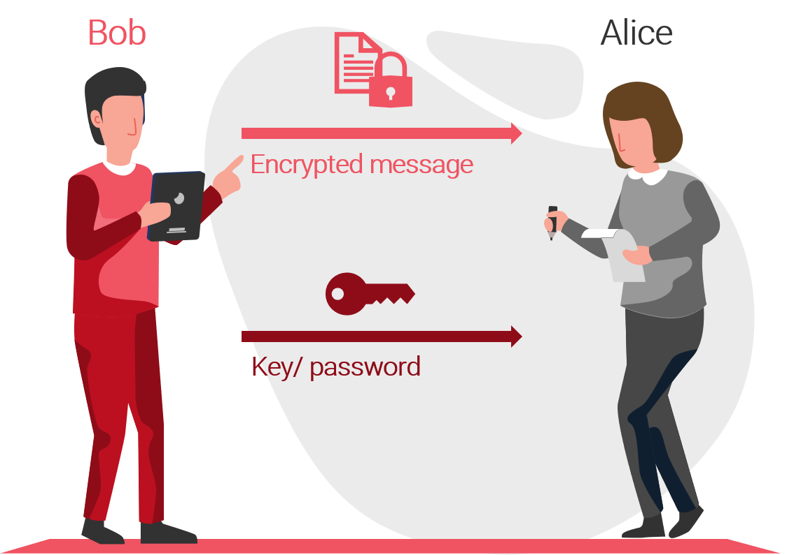
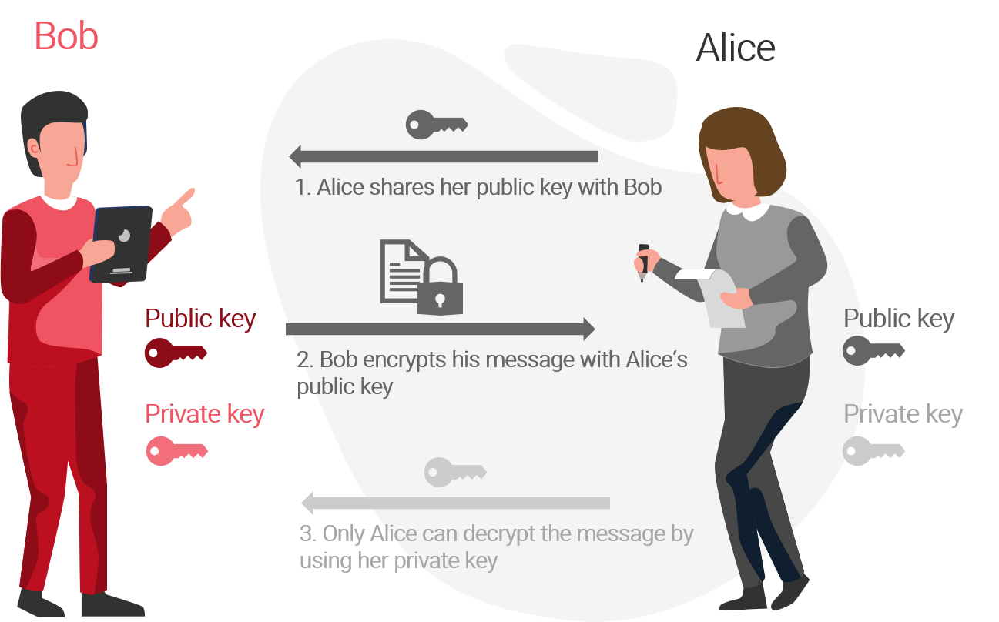

# Asymmetrische Verschlüsselung

## Symmetrische Verschlüsselung

Wie der Name bereits sagt wird bei der symmetrischen Verschlüsselung derselbe Schlüssel zum Ver- und Entschlüsseln von Daten verwendet. Um eine private Kommunikation zu ermöglichen, müssen alle involvierten Parteien über den Schlüssel verfügen können. Dies bedingt, dass der Schlüssel in der Praxis in geheime Meetings, versiegelte Umschläge oder vertrauenswürdige Kanäle mit dem Gegenüber geteilt werden muss. Die symmetrische Verschlüsselung ist entsprechend schlecht skalierbar und anfällig für Angriffe bei Übertragung des Schlüssels. 

## Asymmetrische Verschlüsselung

Die Asymmetrische Verschlüsselung wurde Entwickelt um den Nachteilen der symmetrischen Verschlüsselung entgegenzuwirken und stellt eine wichtige Grundlage aus der Kryptografie im Blockchain-Kontext dar. Asymmetrische Kryptographie löst das Koordinationsproblem welches bei der Übertragung des Schlüssels in der symmetrischen Verschlüsselung bestand. Anstelle der Weitergabe des "Passworts" zur Entschlüsselung einer Nachricht wird dabei eine Kombination aus zwei Schlüsseln verwendet, einem öffentlichen Schlüssel und einem privaten Schlüssel. Oft wird deshalb auch von Private und Public Key Verschlüsselung gesprochen.

Der private Schlüssel ist nur dem Besitzer bekannt und muss sicher verwahrt werden. Der öffentliche Schlüssel hingegen kann ohne Bedenken an jeden weitergegeben werden. Beide Schlüssel sind kryptografisch miteinander verbunden. 

Das folgende Beispiel zeigt, wie durch die Verwendung der Schlüsselpaare eine gesicherte Nachricht übertragen werden kann, ohne dass das Passwort zur Entschlüsselung dem Empfänger zugestellt werden muss. 

1. Alice teilt ihren öffentlichen Schlüssel mit Bob
2. Bob nutzt den öffentlichen Schlüssel von Alice um seine Nachricht zu verschlüsseln.
3. Die von Bob gesendete Nachricht kann nun nur von Alice entschlüsselt werden, da nur sie über ihren privaten Schlüssel verfügt, welcher dazu benötigt wird. 

## Anwendung im Blockchain-Kontext

Eine Anwendung asymmetrischer Kryptografie ist die Aufbewahrung und Übertragung von Kryptowährungen. Der öffentliche Schlüssel \(public key\) stellt dabei die Adresse, auf der sich die Coins befinden dar und kann verwendet werden, um Daten zu verschlüsseln. Der private Schlüssel \(private key\) hingegen ist jenem Passwort gleichzusetzen, welches benötigt wird, um diese Daten erneut zu entschlüsseln. Der private Schlüssel ermöglicht demnach den Zugang zu den eigenen Vermögenswerten auf der Blockchain und soll somit in jedem Fall sicher aufbewahrt werden.

