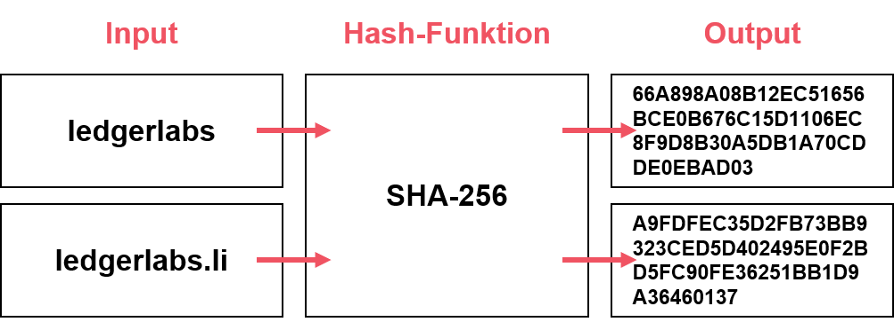

# Hash-Algorithmen

Hash-Funktionen sind kryptografische Ein-Weg-Funktionen, welche einen Input \(Text, Dokumente, etc.\) in einen in der Länge begrenzten alphanumerischen Code \(Hash\) als Output umwandeln. Sie werden heute beispielsweise für die Signatur von Emails oder digitalen Dokumenten verwendet und bilden die Grundlage für den Proof-of-Work-Algorithmus zur Validierung von Transaktionen auf der Blockchain. \(Voshmgir & Kalinov, 2018\)

Wie in der Abbildung ersichtlich führt bereits eine geringfügige Änderung des Funktions-Inputs zu einem komplett unterschiedlichem Output. Unter Verwendung derselben Hash-Funktion und dem gleichen Input erhält man jedoch immer dasselbe Ergebnis. Es lässt sich einfach überprüfen, ob der Hash \(Output\) zu einem bestimmten Datensatz \(Input\) gehört. Alleine vom Hash-Wert \(Output\) kann jedoch nicht auf den Datensatz \(Input\) zurückgeführt werden. Aus diesem Grund handelt es sich um eine Ein-Weg-Funktion. 

Hash-Funktionen wie SHA256 \(Secure Hash Algorithmus\) sind normalerweise Open-Source. Das bedeutet, dass jeder versuchen kann, den Algorithmus zu knacken. Hash-Algorithmen welche bereits lange bestehen und noch von niemandem erfolgreich 


_**TIPP**_ Ein nützliches Tool, um Hash-Funktionen besser zu verstehen bietet die Webseite [https://anders.com/blockchain/hash
](https://anders.com/blockchain/hash
)


